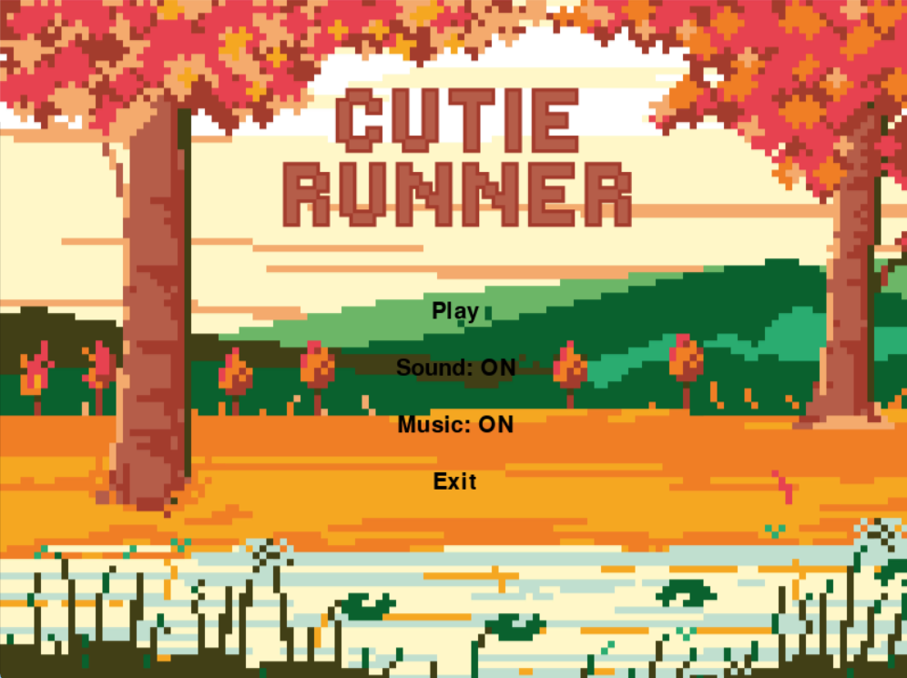
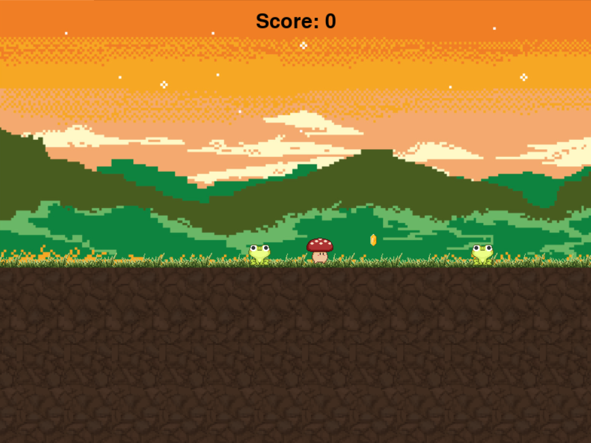

# Pygame-Platformer-
# 🍄 Mushroom Adventure

A charming 2D pixel art platform game built with Pygame Zero where you play as a brave mushroom collecting golden coins while avoiding dangerous frog enemies!

## 🎮 About The Game

Guide your adorable mushroom hero through a beautiful pixel art world! Jump across platforms, collect shiny golden coins, and watch out for the patrolling frogs. The game features smooth animations, charming pixel art graphics, and relaxing background music.

### ✨ Features

- 🍄 *Cute mushroom character* with smooth idle, run, and jump animations
- 🪙 *Collect golden coins* to increase your score
- 🐸 *Frog enemies* that patrol the platforms - avoid them!
- 🎨 *Beautiful pixel art* graphics with a sunset backdrop
- 📊 *Score tracking* system

## 🕹️ KEYS

### Controls
- *Left Arrow* ← : Move left
- *Right Arrow* → : Move right  
- *Up Arrow* ↑ : Jump

### Objective
Collect all 5 golden coins while avoiding the frog enemies to win the game!

## 🎨 Screenshots

  
  

## 🚀 Getting Started

### Prerequisites

- Python 3.7 or higher
- pip (Python package manager)

### Installation

1. *Clone the repository*
bash
git clone https://github.com/aleynactnn/Pygame-Platformer-.git
cd Pygame-Platformer-

2. *Install required packages*
bash
pip install -r requirements.txt

3. *Run the game*
bash
python main.py

    
## 🛠️ Built With

- *Python* - Programming language
- *Pygame Zero* - Easy-to-use game development framework
- *Pixel Art* - Retro-style graphics

## 📝 Requirements

The requirements.txt file includes:

pygame>=2.5.0
pgzero>=1.2.1

## 🤝 Contributing

Contributions, issues, and feature requests are welcome! Feel free to check the issues page.

1. Fork the project
2. Create your feature branch (git checkout -b feature/AmazingFeature)
3. Commit your changes (git commit -m 'Add some AmazingFeature')
4. Push to the branch (git push origin feature/AmazingFeature)
5. Open a Pull Request

## 👩‍💻 Author

*Aleyna Çetin*
- GitHub: [@aleynactnn](https://github.com/aleynactnn)

## 🙏 Acknowledgments

- Pixel art graphics inspired by classic retro games
- Thanks to the Pygame Zero community for the excellent framework
- Background music and sound effects add to the nostalgic gaming experience

---

### 🎮 Enjoy the game and happy mushroom adventures! 🍄

⭐ *Star this repository if you enjoyed playing!*
